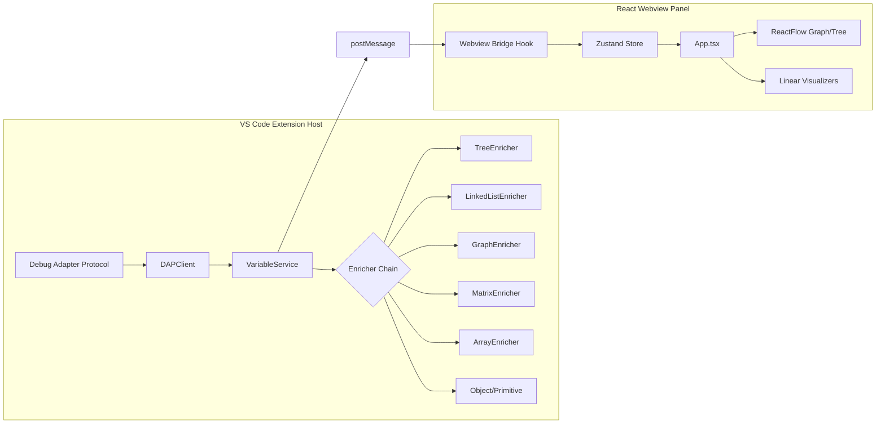

# AlgoVision


AlgoVision is an advanced Visual Studio Code extension designed for computer science education. It intercepts the Debug Adapter Protocol (DAP) to provide real-time, interactive visualizations of memory states and complex data structures during code execution.

> **Note:** The animated demo GIF of AlgoVision in action will be placed here.

---

## 🎯 The Problem & Solution

**The Problem:** Traditional debuggers show memory state as nested, textual tree views. For beginner students learning pointers, linked lists, and tree traversals, mentally mapping a 10-level deep `{ left: Object, right: Object }` JSON structure into a visual binary tree is extremely difficult and hinders learning.

**The Solution:** AlgoVision runs alongside the standard VS Code debugger. It automatically parses the local variable scope, enriches raw memory references into structured types, and renders them in a dedicated webview panel using dynamic, color-coded interactive graphics.

---

## ✨ Features & Supported Structures

AlgoVision goes beyond standard arrays, offering custom layouts for advanced algorithmic structures. It also tracks **pointers** (e.g., `i`, `j`, `lo`, `hi`) and overlays them directly onto the visualization.

| Data Structure | Visual Representation | Features |
|---|---|---|
| **Primitives** | Pill tags | Clean, color-coded types (`string`, `number`, `boolean`). |
| **1D Arrays** | Horizontal contiguous cells | Highlighted mutations, floating active index pointers. |
| **2D Matrices** | Grid / Table layout | Cartesian coordinate visualization for DP and grids. |
| **Linked Lists** | Connected nodes with arrows | Pointer tracking, cycle detection, infinite loop prevention. |
| **Binary Trees** | Hierarchical Tree (`ReactFlow`) | Dynamic Dagre layouts, subtree tracing, DFS highlights. |
| **Graphs (DAG)** | Adjacency graph (`ReactFlow`) | Spring layouts, shortest-path BFS animations. |
| **Objects/Hash** | Key-Value cards | Clean tabular presentation of generic objects. |

---

## 🏗 System Architecture

AlgoVision utilizes a **Chain-of-Responsibility** pattern to enrich raw debugger payloads before passing them via a message bridge to an isolated React webview.



---

## 🚀 How to Use

### Installation
1. Install the `.vsix` package in VS Code.
2. Ensure you are running Node.js 22+ and have a JavaScript file ready to debug.

### Starting a Session
1. Set breakpoints in your JavaScript file.
2. Press `F5` to start a standard Node.js debug session.
3. Open the command palette (`Ctrl+Shift+P` / `Cmd+Shift+P`) and run **`AlgoVision: Visualize JavaScript Code`**.
4. The AlgoVision panel will open to the side.

### Playback Controls
AlgoVision features a dedicated control bar:
- **Play/Pause**: Automatically steps through the code.
- **Step Forward/Back**: Manually traverse execution history.
- **Settings**: Adjust the `algovision.playbackSpeedMs` auto-play interval.
- **Restart**: Re-initialize the debug session and wipe history.

---

## 🛠 Tech Stack

- **Extension Host:** TypeScript, VS Code Extension API.
- **Frontend Framework:** React 18, Vite.
- **State Management:** Zustand.
- **Visualizations:** ReactFlow (Graphs/Trees), Framer Motion (Animations).
- **Testing:** Vitest (100% Enricher Coverage).
- **Icons & Styling:** Lucide React, Custom CSS Variables Design System.

---

## 🤝 Future Work / Contributing

Current limitations and areas for future research:
1. **Python Support:** Expanding the DAP client to understand Python's `__dict__` and `__class__` memory structures.
2. **Reverse Stepping (Time Travel):** True debugger reverse-stepping (currently, "Step Back" uses a cached webview history snapshot, which does not rewind the actual Node.js execution context).
3. **Multi-Column Layouts:** Dynamic grid layouts for heavily populated variable scopes.

Pull requests are welcome!

```bash
# To run locally:
npm ci
npm run build:all
# Then press F5 to launch the Extension Development Host
```
