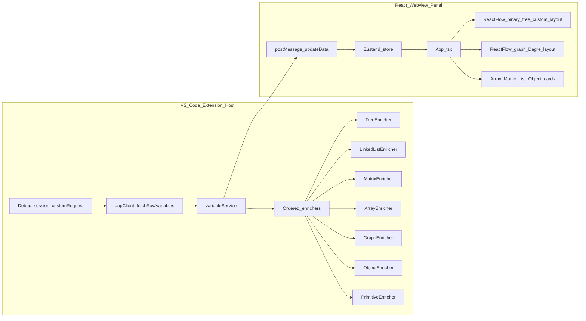

# AlgoVision

**Real-time views of your locals while you debug JavaScript**—arrays, matrices, linked lists, binary trees, small graphs, and plain objects—rendered in a side panel next to the VS Code debugger, with change highlighting between stops.


AlgoVision is a VS Code extension aimed at **teaching and learning**: it does not replace the debugger; it **reads** the same variables the Variables view would show, classifies them with a small TypeScript pipeline, and draws them so structure (especially trees and graphs) is obvious at a glance.

> **Demo:** Drop a short screen recording or GIF here once you have one.

---

## Who it is for

- **Students** stepping through sorts, DP on grids, list mutations, or tree recursion who are tired of squinting at `Object { … }` previews.
- **Instructors** demonstrating in class with the Node debugger: open the panel once, then every breakpoint stop refreshes the picture.

**Target runtime:** JavaScript debugged with the **built-in Node.js** debugger (variable previews and property names match what the enrichers expect).

---

## Quick start

1. Install the extension from a `.vsix` or run it from this repo (see [Development](#development)).
2. Open your JS file, set breakpoints, start debugging (**F5** with a Node launch config).
3. Run **`AlgoVision: Open Visualizer Panel`** from the Command Palette (`Ctrl+Shift+P` / `Cmd+Shift+P`).  
   **Important:** The panel must stay open—each time the debuggee **stops**, the extension pushes a fresh snapshot only if the webview exists.
4. Use **Step Over** from the debugger (or the panel’s **Auto-Play** / **Step Forward**) to move execution; the panel updates on every stop.

---

## What you get in the panel

| Kind            | What it looks like                        | Details                                                                                                                               |
| --------------- | ----------------------------------------- | ------------------------------------------------------------------------------------------------------------------------------------- |
| **Primitives**  | “Locals” strip of compact pills           | Values compared to the previous stop; changed cells pick up accent styling.                                                           |
| **Array**       | Row of cells with `[i]` labels            | Per-index diff vs last snapshot.                                                                                                      |
| **Matrix**      | Grid with row index on the left           | Same idea: cell-level diff highlighting.                                                                                              |
| **Object**      | Key → value rows                          | Highlights rows whose displayed value changed.                                                                                        |
| **Linked list** | Values in a row ending at `null`          | Built by following `head` / `next` via the debug API; traversal is capped at **100** nodes so a cycle cannot hang the UI.             |
| **Binary tree** | **React Flow** diagram                    | Custom vertical layout, optional “ghost” nodes where a child is missing; nodes/edges that changed since the last stop are emphasized. |
| **Graph**       | **React Flow** + **Dagre** (top → bottom) | Object-shaped **adjacency lists** become nodes and directed edges; newly appeared nodes/edges are visually distinct.                  |

**Classification order** (first matching enricher wins—order matters):  
`Tree` → `LinkedList` → `Matrix` → `Array` → `Graph` → `Object` → `Primitive`  
See [`src/enrichers/index.ts`](src/enrichers/index.ts).

---

## Playback and history

The toolbar is meant for **reviewing** what already happened in the webview, not for replacing the debugger UI entirely.

| Control                 | Behavior                                                                                                                                                                                                                       |
| ----------------------- | ------------------------------------------------------------------------------------------------------------------------------------------------------------------------------------------------------------------------------ |
| **Auto-Play / Pause**   | If you are at the **latest** snapshot, each tick sends **Step Over** to VS Code. If you stepped **back** in history, it replays forward through stored snapshots until it reaches the end, then resumes stepping the debugger. |
| **Step Back / Forward** | Moves through **saved snapshots** only. The Node process does not run backwards.                                                                                                                                               |
| **Restart**             | Invokes VS Code’s debug restart and clears webview history.                                                                                                                                                                    |
| **Speed**               | Three presets (Fast / Normal / Slow) adjust delay **in memory** for that session. On load, the initial delay comes from the setting below; changing presets does **not** write `settings.json`.                                |

---

## Workspace settings

| Setting                      | Default | Range        | Role                                                                                                   |
| ---------------------------- | ------- | ------------ | ------------------------------------------------------------------------------------------------------ |
| `algovision.playbackSpeedMs` | `400`   | `100`–`5000` | Milliseconds between auto-play steps when the webview first receives settings from the extension host. |

---

## How it works (architecture)

1. A **debug adapter tracker** listens for **stopped** events from the active session.
2. The extension calls **`customRequest`** on the session: `threads` → `stackTrace` → `scopes` → `variables` ([`src/debugger/dapClient.ts`](src/debugger/dapClient.ts)).
3. Each local is passed through the enricher list; results are sent to the webview with **`postMessage`**.
4. The webview keeps a **Zustand** history stack so you can scrub backwards through past snapshots.



---

## Tech stack

| Layer     | Stack                                                                                    |
| --------- | ---------------------------------------------------------------------------------------- |
| Extension | TypeScript, VS Code Extension API                                                        |
| Webview   | React 19, Vite, Tailwind CSS 4, Zustand, React Flow, Framer Motion, Lucide               |
| Tests     | Vitest, `npm run test:unit` → `src/**/*.unit.test.ts` (enrichers and related host logic) |

---

## Limitations (by design today)

- **JavaScript / Node-shaped DAP data only**—other languages need new heuristics.
- **No true time travel**—Step Back is snapshot-based in the webview.
- **Graph layout** is Dagre hierarchical, not force-directed; there is no built-in shortest-path animation.
- **Unmatched variables** fall back to a primitive-style display with a console warning from the host.

---

## Development

```bash
npm ci
npm run build:all    # compile extension + build webview bundle to webview-dist
npm run test:unit    # Vitest enricher tests
npm run lint         # ESLint on src/
```

Open this folder in VS Code and launch **“Run Extension”** (F5) to start an Extension Development Host with AlgoVision loaded.

To ship a `.vsix`, use the [VSCE CLI](https://github.com/microsoft/vscode-vsce) (`vsce package`) from the repo root after `npm run build:all`.
